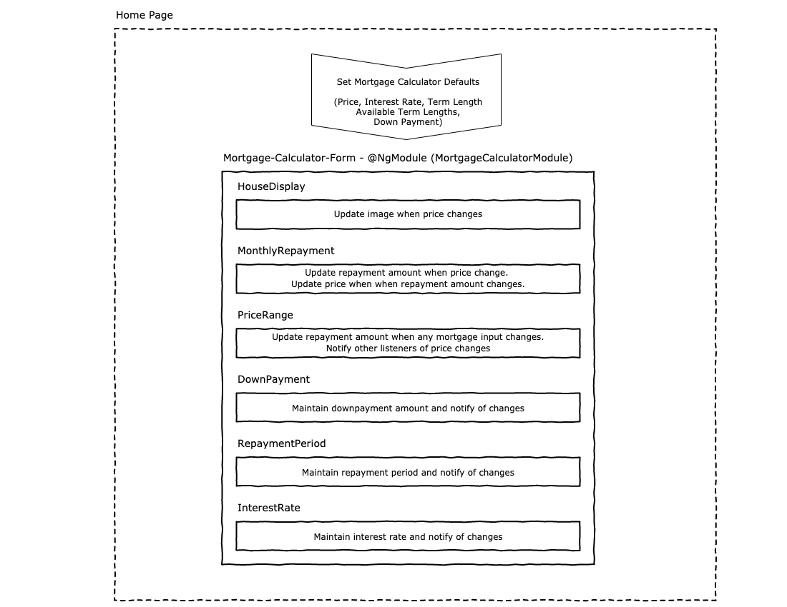
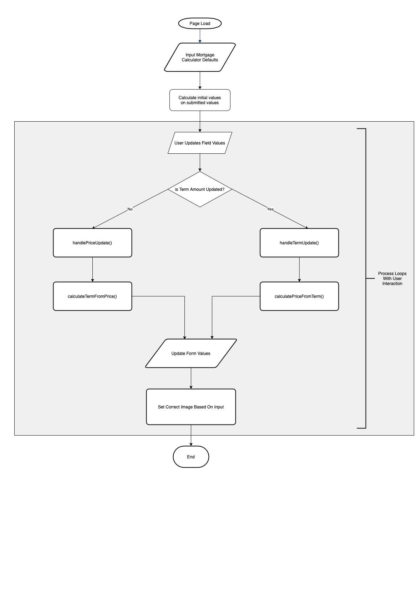

With Node installed, use `npx ionic serve` to run the project

The application is deployed at https://silly-lovelace-91d4c4.netlify.app/ with the build set to *master*.

The component map prior to changes was



The process flow at the last change set was:



A number of bugs and enhancements were identified:

* Updating the value from the term was causing an interesting infinite loop.
* I shifted over to centralising all the logic into the single component to reduce the time needed due to the constraint provided. My preference would have been more granular components that would use OnChanges to allow for the key value to be communicated down.
* The range for the price and repayments are not dynamic, ie setting a value higher than the current limit doesnt allow you increase the range component to respond to it.
* My application of the formular appears to be incorrect. The figures returned appear significantly higher and amending the term length, interest etc doesnt result in any material change. Logic bug probable as opposed to an issue with the formula provided. Code can be found at src/app/mortgage-calculator/services/mortgage-calculator.service.ts

```javascript
  calculateTermFromPrice(
    price: number,
    downPayment: number,
    annualInterestRate: number,
    termYears: number
  ): number {
    const principle = price - downPayment;
    const interestRate = annualInterestRate / 12;
    const termMonths = termYears * 12;
    return Math.ceil(
      principle *
        (interestRate *
        (Math.pow(1 + interestRate, termMonths) /
          (Math.pow(1 + interestRate, termMonths) - 1)))
    );
  }

  calculatePriceFromTerm(
    repaymentAmount: number,
    termYears: number,
    annualInterestRate: number,
  ): number {
    const interestRate = annualInterestRate / 12;
    const termMonths = termYears * 12;
    return Math.ceil(
      repaymentAmount /
        (interestRate *
        (Math.pow(1 + interestRate, termMonths) /
          (Math.pow(1 + interestRate, termMonths) - 1)))
    );
  }
```